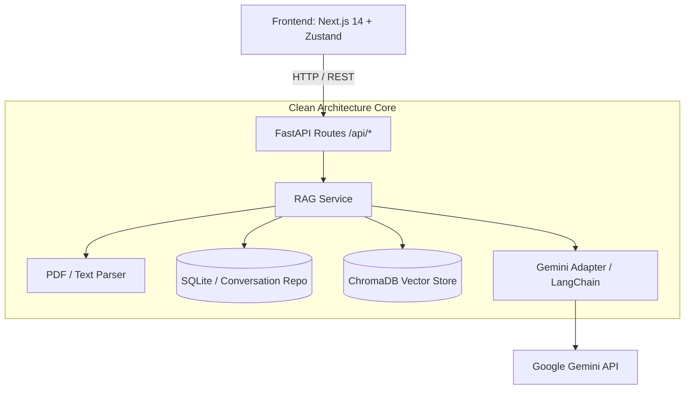

# 🔮 Inteligência Aumentada com RAG Multi-Conversas

[](https://fastapi.tiangolo.com)
[](https://nextjs.org/)
[](https://ai.google.dev/)
[](https://www.trychroma.com/)
[](LICENSE)
[](#)

---

## 📌 Sumário

- [Sobre o Projeto](#-sobre-o-projeto)
  - [O Problema](#o-problema)
  - [A Solução](#a-solução)
  - [Principais Funcionalidades](#principais-funcionalidades)
- [Arquitetura do Sistema](#-arquitetura-do-sistema)
- [Tecnologias Utilizadas](#-tecnologias-utilizadas)
- [Pré-requisitos](#-pré-requisitos)
- [Como Instalar e Rodar](#-como-instalar-e-rodar)
  - [1. Clonar o Repositório](#1-clonar-o-repositório)
  - [2. Configuração do Backend (FastAPI + Python)](#2-configuração-do-backend-fastapi--python)
  - [3. Configuração do Frontend (Next.js + TypeScript)](#3-configuração-do-frontend-nextjs--typescript)
- [Endpoints Principais da API](#-endpoints-principais-da-api)
- [Testes](#-testes)
- [Licença](#-licença)

---

## 📖 Sobre o Projeto

### O Problema
Modelos de Linguagem de Grande Porte (LLMs) frequentemente sofrem com **alucinações**, falta de conhecimento sobre dados privados/corporativos e limites rígidos de janela de contexto. Além disso, a maioria dos protótipos de chat com IA mistura documentos em um único contexto global, gerando respostas contaminadas entre tópicos distintos.

### A Solução
O sistema resolve essas dores através de uma arquitetura **RAG Multi-Sessão** modular e desacoplada baseada em *Clean Architecture*. Cada conversa criada no sistema possui seu próprio escopo isolado de memória e documentos vetorizados, permitindo que o modelo responda com precisão cirúrgica baseado estritamente nas fontes enviadas para aquela sessão e cite as referências (trechos e páginas) utilizadas.

### Principais Funcionalidades
- 📂 **Multi-Conversas Isoladas**: Crie múltiplos tópicos/chats independentes, com histórico persistente e base vetorial própria.
- 📄 **Ingestão Inteligente de Documentos**: Upload de múltiplos PDFs e inserção de textos livres com segmentação (*chunking*) semântica e geração de embeddings.
- 🔍 **Busca Vetorial com ChromaDB**: Recuperação dos trechos mais relevantes baseada em similaridade de cosseno.
- 🤖 **Integração com Google Gemini**: Respostas precisas geradas a partir do modelo multimodal do Google Generative AI / Gemini Embeddings.
- 🎯 **Citações e Fontes Confiáveis**: Toda resposta inclui as referências exatas utilizadas na síntese da resposta.
- 🖥️ **Interface Moderna e Reativa**: Desenvolvida em Next.js (App Router), TailwindCSS, Lucide Icons e Zustand para gerenciamento de estado global.

---

## 🏛️ Arquitetura do Sistema

O backend foi construído seguindo princípios de **Clean Architecture / Ports and Adapters**, facilitando testes e a substituição de provedores de IA ou bancos vetoriais sem impactar as regras de negócio:



---

## 🛠️ Tecnologias Utilizadas

### Backend
- **Linguagem**: Python 3.10+
- **Framework Web**: [FastAPI](https://fastapi.tiangolo.com/) com Uvicorn (ASGI)
- **Validação e Tipagem**: [Pydantic v2](https://docs.pydantic.dev/)
- **Banco Vetorial**: [ChromaDB](https://www.trychroma.com/)
- **Orquestração de IA & RAG**: [LangChain](https://www.langchain.com/) / [langchain-google-genai](https://pypi.org/project/langchain-google-genai/)
- **Processamento de Documentos**: [PyPDF](https://pypdf.readthedocs.io/)
- **Testes Automatizados**: [Pytest](https://docs.pytest.org/), pytest-asyncio, pytest-mock, HTTPX

### Frontend
- **Framework**: [Next.js 14](https://nextjs.org/) (App Router & React 18)
- **Linguagem**: TypeScript
- **Estilização**: [TailwindCSS](https://tailwindcss.com/) & PostCSS
- **Gerenciamento de Estado**: [Zustand](https://zustand-demo.pmnd.rs/)
- **Ícones**: [Lucide React](https://lucide.dev/)
- **Testes Unitários**: [Jest](https://jestjs.io/) & [React Testing Library](https://testing-library.com/react)

---

## 📋 Pré-requisitos

Antes de iniciar, certifique-se de ter instalado em seu ambiente:
- [Git](https://git-scm.com/)
- [Python 3.10+](https://www.python.org/downloads/)
- [Node.js 18.x+](https://nodejs.org/) e npm / yarn / pnpm
- Uma chave de API do **Google Gemini** ([Google AI Studio](https://aistudio.google.com/))

---

## 🚀 Como Instalar e Rodar

### 1. Clonar o Repositório

```bash
git clone https://github.com/CaputiDev/oraculo.git
cd oraculo
```

---

### 2. Configuração do Backend (FastAPI + Python)

1. Acesse o diretório do backend:
   ```bash
   cd backend
   ```

2. Crie e ative um ambiente virtual:
   - **Linux / macOS**:
     ```bash
     python3 -m venv .venv
     source .venv/bin/activate
     ```
   - **Windows (PowerShell)**:
     ```powershell
     python -m venv .venv
     .venv\Scripts\Activate.ps1
     ```

3. Instale as dependências:
   ```bash
   pip install -r requirements.txt
   ```

4. Configure as variáveis de ambiente:
   ```bash
   cp .env.example .env
   ```
   Edite o arquivo `.env` inserindo sua chave da Google AI:
   ```env
   GOOGLE_API_KEY=sua_chave_do_gemini_aqui
   EMBEDDING_MODEL=models/gemini-embedding-001
   GEMINI_MODEL=gemini-3.7-flash
   CHROMA_PERSIST_DIR=./vector_store
   UPLOAD_DIR=./uploads
   PORT=8000
   HOST=0.0.0.0
   CORS_ORIGINS=http://localhost:3000,http://127.0.0.1:3000
   ```

5. Inicie o servidor backend:
   ```bash
   python main.py
   # ou via uvicorn diretamente:
   uvicorn main:app --reload --port 8000
   ```
   O backend estará disponível em `http://localhost:8000`. A documentação interativa Swagger UI estará em `http://localhost:8000/docs`.

---

### 3. Configuração do Frontend (Next.js + TypeScript)

1. Em um novo terminal, acesse o diretório do frontend:
   ```bash
   cd frontend
   ```

2. Instale as dependências:
   ```bash
   npm install
   ```

3. Configure a URL da API (se necessário, crie `.env.local`):
   ```env
   NEXT_PUBLIC_API_URL=http://localhost:8000/api
   ```

4. Inicie o servidor de desenvolvimento:
   ```bash
   npm run dev
   ```
   Acesse a aplicação no navegador em `http://localhost:3000`.

---

## 🔌 Endpoints Principais da API

| Método | Endpoint | Descrição |
| :--- | :--- | :--- |
| `GET` | `/health` | Checagem de integridade do serviço |
| `GET` | `/api/conversations` | Lista todas as conversas persistidas |
| `POST` | `/api/conversations` | Cria uma nova sessão de conversa |
| `GET` | `/api/conversations/{id}` | Obtém detalhes e histórico de uma conversa |
| `DELETE` | `/api/conversations/{id}` | Exclui uma conversa e seus vetores no ChromaDB |
| `POST` | `/api/conversations/{id}/upload` | Upload e indexação de documentos PDF na sessão |
| `POST` | `/api/conversations/{id}/upload-text` | Ingestão e indexação de texto livre na sessão |
| `POST` | `/api/conversations/{id}/chat` | Envia mensagem para a IA consultar os documentos da conversa |
| `GET` | `/api/conversations/{id}/documents` | Lista documentos indexados na conversa |

---

## 🧪 Testes

### Executar Testes do Backend (Python / Pytest)
```bash
cd backend
pytest
```

### Executar Testes do Frontend (Jest / RTL)
```bash
cd frontend
npm run test
```

---

<div align="center">
  <sub>Desenvolvido com ☕ e paixão por Caputi.</sub>
</div>