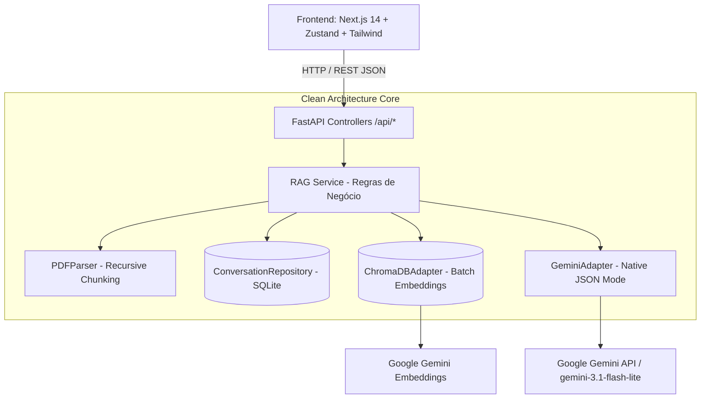

# 🔮 Oráculo: IA com RAG Multi-Conversas & Citações Interativas

[](https://fastapi.tiangolo.com)
[](https://nextjs.org/)
[](https://ai.google.dev/)
[](https://www.trychroma.com/)
[](.github/workflows/ci.yml)
[](#-testes)

---

## 📌 Sumário

- [Sobre o Projeto](#-sobre-o-projeto)
  - [O Problema](#o-problema)
  - [A Solução](#a-solução)
  - [Principais Funcionalidades](#principais-funcionalidades)
- [Arquitetura do Sistema](#-arquitetura-do-sistema)
- [Pipeline de IA & Otimizações de Performance](#-pipeline-de-ia--otimizações-de-performance)
- [Tecnologias Utilizadas](#-tecnologias-utilizadas)
- [Pré-requisitos](#-pré-requisitos)
- [Como Instalar e Rodar](#-como-instalar-e-rodar)
  - [1. Clonar o Repositório](#1-clonar-o-repositório)
  - [2. Configuração do Backend (FastAPI + Python)](#2-configuração-do-backend-fastapi--python)
  - [3. Configuração do Frontend (Next.js + TypeScript)](#3-configuração-do-frontend-nextjs--typescript)
- [Endpoints Principais da API](#-endpoints-principais-da-api)
- [Testes Automatizados (TDD)](#-testes-automatizados-tdd)
- [Licença](#-licença)

---

## 📖 Sobre o Projeto

### O Problema
Modelos de Linguagem de Grande Porte (LLMs) frequentemente sofrem com **alucinações**, falta de conhecimento sobre dados privados/corporativos e contaminação de contexto quando múltiplos documentos e tópicos são misturados na mesma sessão.

### A Solução
O **Oráculo** é uma plataforma corporativa completa de **Chat de IA com RAG (Retrieval-Augmented Generation)** desenvolvida sob os princípios de **Clean Architecture** e **Test-Driven Development (TDD)**. 

Cada conversa possui seu próprio escopo estrito de memória no banco SQLite e documentos vetorizados no ChromaDB. O assistente responde com fundamentação estrita nos documentos anexados e gera **citações interativas com número de página e trecho**, permitindo que o usuário clique na fonte para abrir o documento na página exata.

### Principais Funcionalidades
- 📂 **Multi-Conversas com Isolamento Vetorial**: Crie múltiplas sessões com histórico persistente. A Conversa A nunca lê ou cita documentos da Conversa B.
- ⚡ **Geração Ultra-Rápida (< 1s)**: Otimizado com `gemini-3.1-flash-lite`, modo JSON nativo e controle estrito de latência.
- 📦 **Batch Embedding**: Vetorização de múltiplos blocos em uma única requisição HTTP, acelerando uploads em mais de 15x.
- 🧩 **Recursive Character Chunking**: Segmentação hierárquica por parágrafos e frases que nunca quebra sentenças no meio.
- 📑 **Visualizador de PDFs & Leitor de Textos**: Visualizador embutido sincronizado com a navegação por páginas e modo de inspeção de blocos extraídos.
- 📱 **Interface 100% Responsiva (Desktop & Mobile)**: Painéis laterais (Histórico e Documentos) recolhidos por padrão, abrindo como gavetas fluidas no mobile ou split-screen no desktop.

---

## 🏛️ Arquitetura do Sistema

Construído seguindo **Clean Architecture / Ports and Adapters (Inversão de Dependências)**, separando as camadas de Domínio/Serviços dos Adaptadores externos (Google GenAI, ChromaDB, SQLite, PyPDF):



---

## ⚡ Pipeline de IA & Otimizações de Performance

| Otimização | Antes | Agora (Otimizado) | Benefício |
| :--- | :--- | :--- | :--- |
| **Modelo Principal** | `gemini-3.7-flash` (fila/throttling de ~500s) | `gemini-3.1-flash-lite` | **Respostas em < 1 segundo** |
| **Vetorização de Upload** | `N` requisições HTTP sequenciais | **Batch Embedding** em lote de até 50 blocos | **Upload 15x mais rápido** |
| **Segmentação de Texto** | Fatiamento seco a cada 1000 caracteres | **Recursive Character Chunking** (parágrafos e frases) | **Zero frases cortadas ao meio** |
| **Busca de Perguntas** | Requisição de rede a cada busca | **Cache de Embeddings em Memória (LRU)** | **0.0000s** em termos recorrentes |
| **Modo de Resposta** | Prompt de texto com ` ```json ` | **`response_mime_type="application/json"` Nativo** | **Parsing 100% seguro sem alucinações** |

---

## 🛠️ Tecnologias Utilizadas

### Backend
- **Linguagem**: Python 3.10+ (compatível com 3.10, 3.11, 3.12, 3.13, 3.14)
- **Framework Web**: [FastAPI](https://fastapi.tiangolo.com/) & [Uvicorn](https://www.uvicorn.org/)
- **Validação de Schemas**: [Pydantic v2](https://docs.pydantic.dev/)
- **Banco Vetorial**: [ChromaDB](https://www.trychroma.com/) (persistência local)
- **Banco Relacional**: SQLite3 local com migrations automáticas
- **Modelos de IA**: [Google Generative AI](https://ai.google.dev/) (`gemini-3.1-flash-lite`, `gemini-embedding-001`)
- **Processamento de PDFs**: [PyPDF](https://pypdf.readthedocs.io/)
- **Testes**: [Pytest](https://docs.pytest.org/), pytest-asyncio, pytest-mock

### Frontend
- **Framework**: [Next.js 14](https://nextjs.org/) (App Router & React 18)
- **Linguagem**: TypeScript
- **Estilização**: [TailwindCSS](https://tailwindcss.com/)
- **Gerenciamento de Estado**: [Zustand](https://zustand-demo.pmnd.rs/) (`useConversationStore`, `useViewerStore`)
- **Ícones**: [Lucide React](https://lucide.dev/)
- **Testes Unitários**: [Jest](https://jestjs.io/) & [React Testing Library](https://testing-library.com/react)

---

## 📋 Pré-requisitos

- [Git](https://git-scm.com/)
- [Python 3.10+](https://www.python.org/downloads/)
- [Node.js 18.x+](https://nodejs.org/) e npm
- Chave de API do **Google Gemini** ([Google AI Studio](https://aistudio.google.com/))

---

## 🚀 Como Instalar e Rodar

### 1. Clonar o Repositório

```bash
git clone https://github.com/CaputiDev/oraculo.git
cd oraculo
```

---

### 2. Configuração do Backend (FastAPI + Python)

1. Acesse o diretório do backend:
   ```bash
   cd backend
   ```

2. Crie e ative o ambiente virtual:
   - **Windows (PowerShell)**:
     ```powershell
     python -m venv .venv
     .venv\Scripts\Activate.ps1
     ```
   - **Linux / macOS**:
     ```bash
     python3 -m venv .venv
     source .venv/bin/activate
     ```

3. Instale as dependências:
   ```bash
   pip install -r requirements.txt
   ```

4. Crie o arquivo `.env` baseado no `.env.example`:
   ```bash
   cp .env.example .env
   ```
   Configure suas credenciais no `.env`:
   ```env
   GOOGLE_API_KEY=sua_chave_do_gemini_aqui
   EMBEDDING_MODEL=models/gemini-embedding-001
   GEMINI_MODEL=gemini-3.1-flash-lite
   CHROMA_PERSIST_DIR=./vector_store
   UPLOAD_DIR=./uploads
   PORT=8000
   HOST=0.0.0.0
   CORS_ORIGINS=http://localhost:3000,http://127.0.0.1:3000
   ```

5. Inicie o servidor:
   ```bash
   python main.py
   ```
   O backend estará ouvindo em `http://localhost:8000` (Swagger UI: `http://localhost:8000/docs`).

---

### 3. Configuração do Frontend (Next.js + TypeScript)

1. Em outro terminal, acesse o diretório do frontend:
   ```bash
   cd frontend
   ```

2. Instale as dependências:
   ```bash
   npm install
   ```

3. Inicie o servidor de desenvolvimento:
   ```bash
   npm run dev
   ```
   Acesse a aplicação no navegador em `http://localhost:3000`.

---

## 🔌 Endpoints Principais da API

| Método | Endpoint | Descrição |
| :--- | :--- | :--- |
| `GET` | `/health` | Checagem de integridade do serviço |
| `GET` | `/api/conversations` | Lista todas as sessões de conversa salvas |
| `POST` | `/api/conversations` | Cria uma nova sessão de conversa |
| `GET` | `/api/conversations/{id}` | Retorna histórico completo de mensagens e arquivos de uma sessão |
| `DELETE` | `/api/conversations/{id}` | Exclui conversa, histórico e remove seus vetores do ChromaDB |
| `POST` | `/api/conversations/{id}/upload` | Upload e indexação em lote (Batch) de PDFs na conversa |
| `POST` | `/api/conversations/{id}/upload-text` | Ingestão e indexação de texto livre na conversa |
| `POST` | `/api/conversations/{id}/chat` | Consulta RAG isolada com citações interativas |
| `GET` | `/api/conversations/{id}/documents` | Lista documentos pertencentes à conversa |
| `GET` | `/api/conversations/{id}/documents/{file_name}` | Retorna chunks e metadados de um documento específico |

---

## 🧪 Testes Automatizados (TDD)

Toda a lógica de negócios e componentes de UI possuem cobertura rigorosa de testes:

### Backend (10 testes - Pytest)
```bash
cd backend
pytest -v
```
- ✅ `test_conversation_repository_crud`: Criação, leitura, mensagens e deleção no SQLite.
- ✅ `test_rag_service_isolates_conversations`: Isolamento estrito de busca vetorial entre conversas.
- ✅ `test_pdf_parser_extracts_pages_with_metadata`: Extração precisa de metadados por página.
- ✅ `test_pdf_parser_handles_empty_pages`: Tratamento seguro de páginas em branco.
- ✅ `test_text_parser_splits_free_text`: Segmentação de texto livre.
- ✅ `test_recursive_chunking_preserves_paragraphs`: Preservação semântica de parágrafos e frases.
- ✅ `test_ingest_pdf_success`: Ingestão completa de PDF.
- ✅ `test_ingest_text_success`: Ingestão completa de texto livre.
- ✅ `test_answer_query_with_citations`: Geração de resposta com citações estruturadas.
- ✅ `test_answer_query_empty_knowledge_base`: Tratamento de base sem documentos.

### Frontend (15 testes - Jest & React Testing Library)
```bash
cd frontend
npm test
```
- ✅ `useConversationStore.test.ts`: Criação, seleção, mensagens, arquivos e sidebars recolhidos.
- ✅ `useViewerStore.test.ts`: Controle de páginas, zoom, documentos e `jumpToCitation`.
- ✅ `ChatArea.test.tsx`: Renderização, envio de mensagens e interação com `CitationBadge`.

---

## 📄 Licença

Este projeto está sob a licença [MIT](LICENSE).

---

<div align="center">
  <sub>Construído com ☕, Clean Architecture e TDD por <b>Caputi</b>.</sub>
</div>